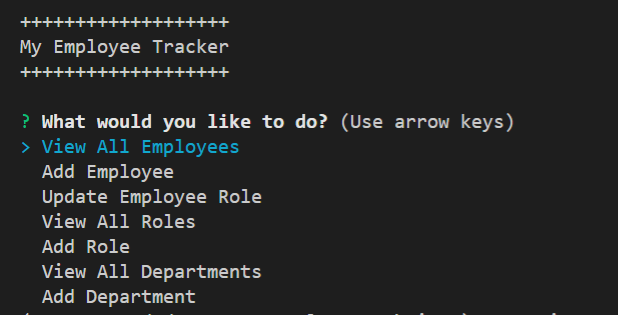
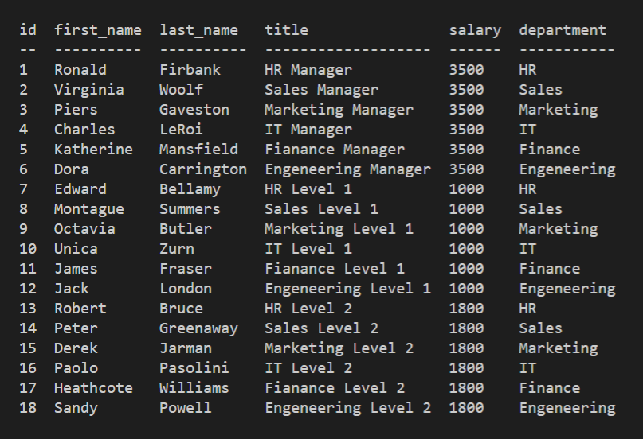
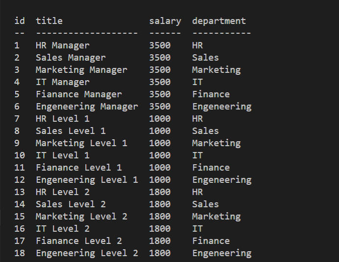

# My Employee Tracker
  

  
  
  ## Description
  This project is to build a simple command line interface to a SQL database to veiw employee, departments and roles

  ### Tools and Languages used
  
  
  
  

  
  
  

  
  
  ## Screenshots
  
  
  

  

  

  ## Links
  GitHub Repository: https://github.com/wizzle13/my-employee-tracker

  Video URL: https://drive.google.com/drive/folders/1czvzOhJv8g8ee-K1Z9A9-SeFugAxS-1i?usp=sharing

  &copy;2020 by Chris Burton